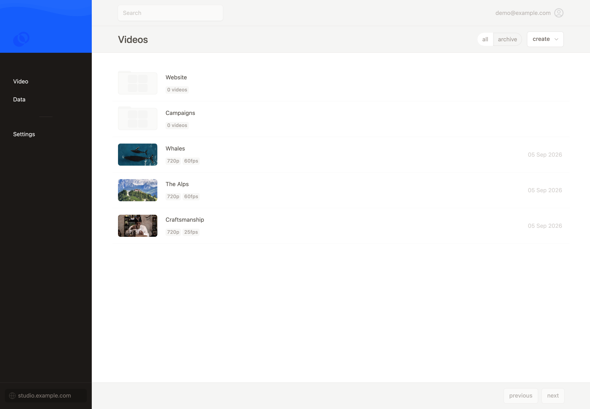
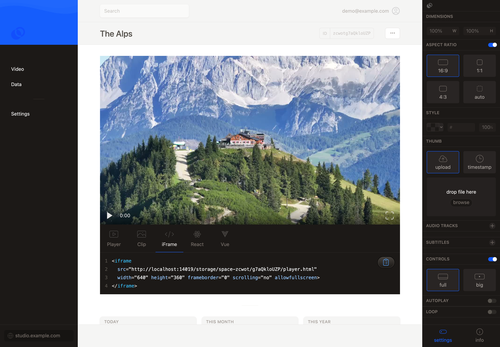
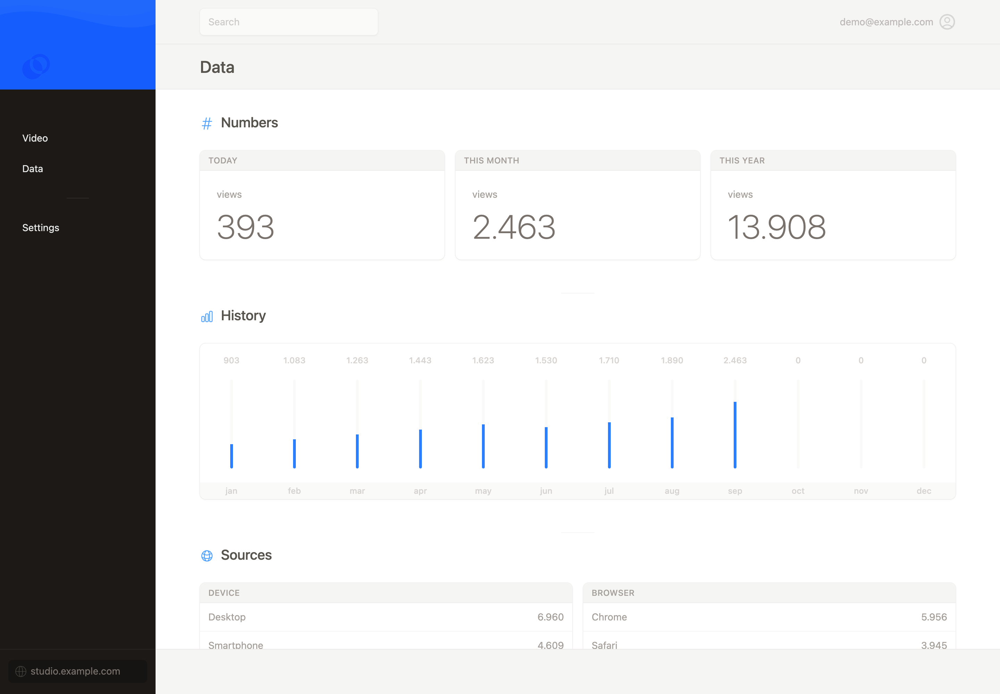
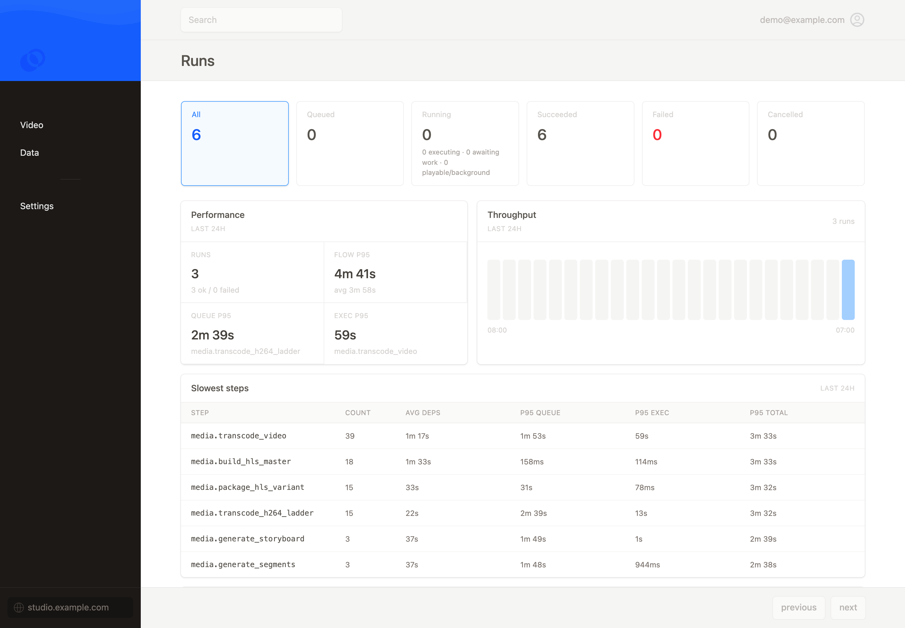
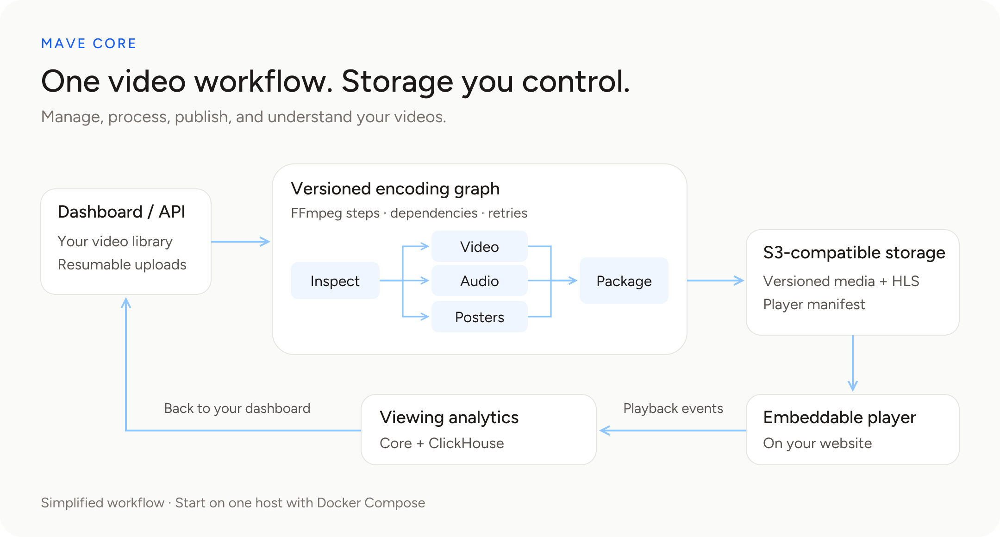

<a href="https://mave.io">
  <picture>
    <source media="(prefers-color-scheme: dark)" srcset="docs/images/mave-logo-white.svg">
    
  </picture>
</a>

# Mave Core

### Your videos. Your storage. From upload to playback.

Mave Core is an open-source video platform with a dashboard, a programmable
encoding pipeline, an embeddable player, and built-in analytics. Upload, process,
and publish videos — with your media in S3-compatible storage that you control.

[Get started](#self-hosted-quickstart) · [Self-hosting guide](deploy/self-hosted/README.md) ·
[Contribute](CONTRIBUTING.md)

## One place for your videos

- **Manage:** organize videos into folders, invite your team, and replace a
  video without changing its public embed.
- **Publish:** resumable uploads, adaptive HLS, posters, subtitles, and
  customizable player settings.
- **Integrate:** embed with web components, iframe, React, or Vue; automate
  with the video API and signed webhooks.
- **Understand:** see views, drop-off, and viewing sources in your dashboard,
  backed by your own ClickHouse instance.

<table>
  <tr>
    <td width="50%">
      <strong>Organize your videos</strong><br>
      <a href="docs/images/dashboard-library.png"></a>
    </td>
    <td width="50%">
      <strong>Customize and embed</strong><br>
      <a href="docs/images/dashboard-player.png"></a>
    </td>
  </tr>
  <tr>
    <td width="50%">
      <strong>Understand your audience</strong><br>
      <a href="docs/images/dashboard-analytics.png"></a>
    </td>
    <td width="50%">
      <strong>Inspect your encoding pipeline</strong><br>
      <a href="docs/images/dashboard-flow-runs.png"></a>
    </td>
  </tr>
</table>

## Self-hosted quickstart

You need Docker with Compose **2.24.4 or newer**. Start with 4 CPU cores,
8 GB RAM, and 20 GB free disk; allow more for your media.

From this repository:

```sh
docker compose up
```

Wait for “Mave is ready” in your terminal, then open its setup link. Your one-time
code is filled in automatically; enter your email to create your first workspace.
You can also open [localhost:4000](http://localhost:4000) and paste the code manually.
To show the welcome message again:

```sh
docker compose logs welcome
```

The first build takes a while: it includes the application, FFmpeg, and storage.
Subsequent starts reuse the build cache. Databases, media, and generated secrets live
in persistent Docker volumes; ordinary stops and restarts keep them intact.
You do not need to copy an environment file or install Elixir, Node.js, or OpenSSL.

The default installation is accessible only from your machine. First login is
immediate; configure SMTP for later email logins and team invitations, or use the
owner recovery command shown in the setup form. For development with live reload
and a local email inbox, see [Contributing](CONTRIBUTING.md#run-with-docker).

The bundle includes Core, PostgreSQL, ClickHouse, MinIO, tusd, and Caddy.
Browser components load from Mave's hosted CDN by default; no local components
build is needed, but the browser needs internet access.

See the [self-hosting guide](deploy/self-hosted/README.md) for public hosting,
HTTPS, email, ports, storage, and upgrades. The existing scripted installer is
also supported. Neither standalone startup path changes applications embedding
Core, including Mave SaaS.

## From upload to playback



Each upload runs through a versioned DAG: a dependency graph that inspects the
source, encodes renditions, packages HLS, and generates visual assets. Steps
record their status and outputs, making processing inspectable and retryable.
Media is published at versioned S3 paths through a player manifest.

Core uses Elixir, Phoenix, Oban, and FFmpeg. The graph fixes the workflow and
output addressing; it does not guarantee bit-for-bit identical encoding.
Contributor references are in [CONTRIBUTING.md](CONTRIBUTING.md#code-and-references).

## Make Core your own

See [private playback](docs/private_playback.md) for per-video access controls,
local MinIO support and deployment adapter integration.

- **Your storage:** use a compatible hosted S3 provider or run your own storage.
  MinIO is the bundled default, not a requirement. Other providers need matching
  storage, upload, and public-media configuration; see the
  [storage requirements](deploy/self-hosted/README.md#storage-compatibility).
- **Your pipeline:** choose renditions and combine built-in steps into your own
  versioned encoding pipeline through the [flow APIs](docs/flow_engine.md#api-surface).
- **Your steps:** implement `MaveCore.Flow.Step.run/2` in an Elixir module,
  register it in [StepRegistry](lib/mave_core/flow/step_registry.ex), and use it
  in your pipeline. New step implementations require rebuilding Core; see
  [contributing](CONTRIBUTING.md) for local development and tests.

## Prefer managed hosting?

Self-hosting means managing your services, storage, email, capacity, updates,
and backups. If you would rather focus on your videos,
[Mave](https://www.mave.io/) offers managed hosting.

## Contributing and security

See [CONTRIBUTING.md](CONTRIBUTING.md) to develop and test locally.
Report vulnerabilities privately as described in [SECURITY.md](SECURITY.md).

## License

Copyright (c) mave.io B.V. Mave Core offers two licensing options for
Mave-authored code and documentation:

- **Open source:** [AGPL-3.0-or-later](LICENSE), the GNU Affero General Public
  License version 3 or, at your option, any later version. Commercial use,
  including hosting, is permitted subject to its source-sharing and other terms.
- **Commercial:** a separate commercial agreement with mave.io B.V. for use or
  integration under alternative terms. [Contact us](https://www.mave.io/contact/)
  to discuss commercial licensing.

Without a separate commercial agreement, the AGPL applies. Third-party code,
media, and marks retain their own terms under either option; see
[Third-party notices](THIRD_PARTY_NOTICES.md).
