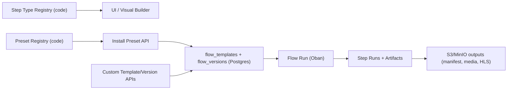

# Flow Engine (Developer Guide)

The flow engine runs media processing as a versioned step graph (DAG) using Oban, with FFmpeg-heavy steps on FLAME workers.

## Mental Model

- `step type` (registry): code-level capability, discoverable via `GET /v1/flow/step-types`.
- `preset` (registry): code-level starter flow definition, discoverable via `GET /v1/flow/presets`.
- `template` (DB): named flow (`publish_default`).
- `version` (DB): immutable template definition snapshot (DAG JSON + checksum).
- `run` (DB): one execution of a template/version.
- `step run` + `artifact`: per-step state and produced outputs (for example `manifest.json` in S3/MinIO).

## Why Preset Install Exists

Presets are stored in code, but runs execute DB-backed template versions.

`POST /v1/flow/presets/:slug/install` is the bridge:

- creates or updates the `flow_template` row for that slug
- creates a new active `flow_version` only when the preset definition checksum changed
- returns existing active version when unchanged (idempotent install)
- returns `201 Created` when a new version is created, `200 OK` when unchanged

That lets you:

- ship default flows in OSS code
- roll out updates as new immutable versions
- keep runtime execution/version selection entirely data-driven
- run a simple "install once per environment after deploy" workflow

## Architecture



## API Surface

- `GET /v1/flow/step-types`
- `GET /v1/flow/presets`
- `POST /v1/flow/presets/:slug/install`
- `POST /v1/flow/templates`
- `POST /v1/flow/templates/:template_id/versions`
- `POST /v1/flow/runs`
- `GET /v1/flow/runs/:id`

Current built-in preset:

- `publish_default`
- `publish_local` (lighter local-development preset without HEVC/AV1 variants)

Flow endpoints are admin-only. Requests are allowed only when the logged-in user
email matches `:mave_core, :flow_admin` `emails` or `email_domains`;
state-changing requests also need a valid CSRF token.
Protected analytics endpoints are exposed at `/api/v1/videos/:embed_id/data` and
`/api/v1/spaces/:space_hash/data` using the standard API key authentication flow.
Per-second dropoff graphs support videos up to four hours. Out-of-range duration
observations are ignored; this does not limit uploads, playback, or view counts.

The examples below use the default local origin, `http://localhost:4000`.
Use your own space and embed identifiers in place of the example values.

## Quick Start

1. Install the default preset into DB:

```bash
curl -X POST http://localhost:4000/v1/flow/presets/publish_default/install \
  -H "content-type: application/json" \
  -H "cookie: $MAVE_ADMIN_COOKIE" \
  -H "x-csrf-token: $MAVE_ADMIN_CSRF_TOKEN" \
  -d '{}'
```

2. Start a run (minimal input):

```bash
curl -X POST http://localhost:4000/v1/flow/runs \
  -H "content-type: application/json" \
  -H "cookie: $MAVE_ADMIN_COOKIE" \
  -H "x-csrf-token: $MAVE_ADMIN_CSRF_TOKEN" \
  -d '{
    "template_slug": "publish_default",
    "execution": "inline",
    "input": {
      "space_hash": "ubg50",
      "embed_hash": "LeDE9v86ye",
      "input_url": "https://example.com/video.mp4"
    }
  }'
```

3. Check run state:

```bash
curl "http://localhost:4000/v1/flow/runs/$MAVE_FLOW_RUN_ID" \
  -H "cookie: $MAVE_ADMIN_COOKIE"
```

## Execution Modes

`POST /v1/flow/runs` supports:

- `execution: "inline"` (or `"sync"`): run inside request lifecycle, returns `200`.
- async/default (`execution` omitted): run scheduled on Oban, returns `202`.

Use inline for local debugging and deterministic smoke tests. Use async for production behavior.

`enqueue` is accepted (`true` by default), but most users should not set it manually.

## Audio player waveforms

The publishing presets include optional `media.generate_audio_peaks` background
work after inspection and audio transcoding. It analyzes the processed primary
audio track on FLAME with FFmpeg and stores `<embed>/vN/audio_peaks.json` (or
`<embed>/audio_peaks.json` for version zero). It runs for both audio and video
uploads with audio; silent sources are skipped. It does not delay the playable
manifest. Waveform videos and their derived
HLS playback and thumbnail branches are no longer generated. The retired
`media.transcode_waveform` step is a successful no-op in older immutable flows.

The output is included in `manifest.json` as
`waveform: {version: 1, duration, audio_track, peaks}`. `audio_track` is the analyzed
track's filename. At most 512 linear amplitude peaks cover the complete timeline;
silence is zero. Analysis measures the loudest channel without mixing channels
together. Unsupported durations (missing, nonpositive, or over 24 hours) omit the
waveform without preventing playback. This limit applies only to visualization.

`<mave-audio>` plays the published audio tracks from audio or video uploads.
Its `type="line"` is the standard timeline; `type="wave"` displays measured bars.
The independent `theme` attribute selects `default`, `dolphin` or `synthwave`;
`controls="full thumbnail"` opts into the poster image.
Older uploads and alternate tracks without matching peaks use a normal timeline.
It never downloads video renditions as an audio fallback. `<mave-player>` keeps
its existing video presentation. Audio-track files are already part of the
public manifest contract.

Rollout requires the updated component bundle and Core release. Starting a new
run by a built-in preset slug automatically installs its updated version. Pinned
or custom flow versions need updating separately; existing immutable runs do not
gain new steps. Reprocessing with an updated flow generates peaks
for old uploads; there is no automatic media backfill. Settings publications keep
waveform data for the same media version. Custom flows can add the optional step
with dependencies on `inspect_media` and `transcode_audio`.

## Step Placement (Inline vs FLAME)

By default:

- FLAME: heavyweight transfer/media steps (`asset.upload_original`, non-booster `media.transcode_*`, `media.extract_frame`, `media.generate_*`)
- Serverless booster: video/audio transcodes, frame extraction, and video/audio HLS packaging when the deployment enables it
- Inline: lightweight orchestration and HLS publication steps (`source.resolve`, `storage.ensure_space_bucket`, `media.package_hls_*`, `manifest.build`, `cdn.purge`, `event.notify_webhook`, etc.)

`GET /v1/flow/step-types` returns step metadata (`type`, `category`, `description`, `options`) so a visual builder can render clear, stable controls (for example step-level `strict`).

### Retry and orphan recovery

Flow step execution has a ledger-level retry budget independent of Oban's job
attempt counter. Queue admission snoozes may increase the Oban counter without
running a step, so `step_runs.attempt` and `execution_metadata.retry_policy`
are authoritative for actual execution.

By default, one automatic cycle permits at most three executions and one
orphan recovery. Exhausting either budget fails the step and lets the
coordinator fail or continue the run according to the step's required policy.
An explicit operator retry from `/flow/runs` starts a new automatic cycle while
preserving the lifetime step attempt count for diagnostics.

Recovery cancels the orphaned Oban job before scheduling its replacement.
Jobs belonging to terminal runs complete as cleanup and are not retried.
Recovering a failed run keeps succeeded steps and their artifacts intact. Any
parallel steps interrupted when the run became terminal are reset with a fresh
automatic retry budget, so completed renditions are not encoded again.

### FFmpeg performance metadata

FFmpeg-backed media steps persist their final command performance summary in
`step_runs.execution_metadata.progress`. This includes video, audio, waveform,
frame, storyboard, segment, and HLS packaging work. The summary includes
realtime speed and FFmpeg wall time, plus encoded frames, average FPS, output
bytes, and dropped or duplicated frames when FFmpeg reports them. Audio and
single-frame commands normally do not report a meaningful FPS. `/flow/runs`
displays the available per-step values and aggregates completed realtime-speed
samples by hardware profile and workload.

Set `MAVE_HARDWARE_PROFILE` inside the worker runtime to a stable deployment
label such as `scaleway-gp1-s`. The value should identify the instance class,
not an ephemeral pod or node. Deployment layers with multiple FLAME pools can
map pool-specific configuration to this generic worker variable.

### Optional serverless encoding booster

Oban remains the source of truth for job state, retries, progress, validation,
and uploads. Eligible foreground H.264 steps run in the dedicated `flow_booster`
queue, while post-playable work runs in `flow_booster_background`. Both call the
external streaming container directly without reserving a FLAME runner.
`publish_default` defines SD, HD, FHD, QHD, and UHD as five independent steps.
The flow starts from tusd's `post-finish` hook, so inspection and encoding
can read the completed object from the upload bucket without waiting for
`upload_original` to copy it. After inspection, the SD, HD, and FHD steps become
ready together so separate serverless instances can encode the baseline playback
ladder concurrently. Each CPU booster streams one encoded MP4 output directly to
object storage through short-lived multipart URLs issued by Core. The
coordinating worker receives progress and result metadata only; it does not
proxy, download, remux, or stage rendition bytes. The matching HLS flow step
consumes that already-published output. HLS packaging also stays off the app
worker's disk. FFmpeg atomically finalizes each segment on the CPU booster, which
exchanges a short-lived prefix-scoped token with Core for per-object signed PUT
destinations. Each finalized segment is uploaded and removed from bounded
booster scratch while packaging continues; the init file and exact playlist are
published last. Core verifies the published object sizes and persists only
metadata.
Optional QHD/UHD, H.264 clip-keyframe, and HEVC/AV1 clip work starts only after
the playable manifest has been published. Clip sizes are conditional on the
source resolution. QHD and UHD refresh the root HLS playlist in separate,
ordered steps, so a completed QHD variant is published without waiting for UHD.
Configure the background queue below total booster capacity to reserve slots
for new uploads. For example, a background limit of four out of eight slots
leaves four foreground slots available. Final flow publication writes
completed clips to both the rendition records and `manifest.json`.

Booster admission is work-conserving across spaces. Each queue divides its
capacity by the number of spaces with runnable jobs and rounds up, so one busy
space can borrow nearly all idle foreground slots instead of stopping at a fixed
six-job ceiling. A small configurable headroom remains available for the first
request from another space. When another space starts waiting, already-running
encodes are not interrupted; spaces above their new share simply stop refilling
completed slots until the waiting spaces catch up. The same policy lets optional
work use the background allowance without crossing its hard ceiling. Shared PostgreSQL
advisory locks, active-step counts, and the space identifier persisted in each
Oban step job keep the global and per-space limits valid if the coordinating
worker is scaled horizontally. Only available and executing jobs count as
current demand; jobs sleeping for a future retry or explicit schedule do not
dilute another space's share. Background admission also has a configurable
per-run safety ceiling, defaulting to six active jobs. The ceiling is
work-conserving: one run can borrow all six when capacity is idle, while its
current share automatically shrinks as more runs demand the reserved background
capacity. This prevents one unusually large source from creating an unbounded
number of simultaneous object-storage reads while unrelated videos and spaces
can still fill the shared capacity. The default
publishing preset uses the generic
video step for its HEVC and AV1 clips without placing those alternative codecs
on the initial playback path. Downstream flow steps perform frame extraction.
CPU-booster renditions whose inspected source duration exceeds two hours are
split into sequential 30-minute source intervals. Each interval is a separate
bounded Serverless request whose fragmented MP4 output is stored under a
deterministic temporary object key. Completed interval objects survive an app
worker restart and are reused by a retry. A final booster request reads those
objects and losslessly concatenates them into a multipart destination object;
the app worker still handles metadata only. Temporary interval objects are
deleted after the final object has been verified. This keeps every provider
request inside the Serverless timeout while the independent SD, HD, and FHD
flow steps continue to use separate instances. Long-source failures remain on
the booster retry path instead of delegating a predictably oversized encode to
FLAME.

The completed upload-bucket object remains the canonical source for inspection
and the primary playback renditions, even after `upload_original` has published
a customer-bucket copy. H.264 keyframe, HEVC, and AV1 clips read that canonical
source directly so they do not compound loss from an H.264 intermediate. Their
dependencies on the matching H.264 steps preserve playback-first scheduling;
those dependency outputs are not used as transcode inputs. Storyboard and
seek-segment generation still read SD H.264. Waveforms and WebP/AVIF frames also
read the canonical original. The copy runs in parallel as a durable backup and
is neither an initial-encoding nor an initial-playback dependency. Once the flow
is terminal, Core republishes the final manifest with the durable customer-bucket
original.

H.264 keyframe clips retain the legacy encoder's first-10-seconds, GOP-2, CRF 23
contract, but omit audio. A GOP of two frames produces much larger output than a
normal sparse-keyframe rendition, and CRF can exceed the nominal target bitrate.
Core therefore applies a generous multipart-capacity floor that scales with the
square of the target long edge instead of relying only on the ordinary bitrate
estimate. The booster can complete the actual parts it uses; unused presigned
part URLs have no storage cost.
Only after that write succeeds does it change the temporary upload object's ACL
back to private. A manifest publication or ACL failure leaves the upload object
public, preserving playback and a usable retry source.

The deployment must provision the upload bucket's authenticated tusd writer and
browser GET/HEAD CORS before accepting uploads. Core assigns every new object a
server-validated `<space_hash>/<random_id>.<extension>` key and replaces the
client's JWT metadata with non-secret, server-validated authorization references
before S3 multipart creation. Progress and finish hooks recheck token expiry and
the API key's current access level without exposing the JWT on the completed
object. At `post-finish`, Core
applies a public-read object ACL to a completed standard upload before starting
its flow; custom thumbnails, audio tracks, and subtitles remain private. No
bucket policy or anonymous bucket listing is required. Boosters can then stream
the completed original over plain HTTPS. After inspection, Core publishes
`player.html` and a processing `manifest.json` whose `video.original` points at
that upload object. Only after both writes succeed does Core persist the
processing-player readiness marker and broadcast that upload playback is ready;
a succeeded inspect or original-copy step alone is not considered playable. The
existing `<mave-player>` can therefore play the original while encoding
continues. Each completed player-compatible rendition refreshes the manifest;
as soon as an MP4 or HLS video rendition is available, the manifest stops
exposing the original URL and playback uses the completed renditions. The
durable customer-bucket original remains the canonical processing source and
backup without being advertised to the player.

The feature is disabled by default. Configure it on the Kubernetes worker runtime:

```text
MAVE_ENCODING_BOOSTER_ENABLED=true
MAVE_ENCODING_BOOSTER_ENDPOINT=https://encoding-booster.example.com
MAVE_ENCODING_BOOSTER_IAM_SECRET_KEY=<Scaleway IAM secret key>
MAVE_ENCODING_BOOSTER_WARMUP_REQUESTS=12
MAVE_ENCODING_BOOSTER_WARMUP_HOLD_MS=15000
MAVE_ENCODING_BOOSTER_READINESS_CHECK_ENABLED=false
MAVE_ENCODING_BOOSTER_FALLBACK_ENABLED=true
MAVE_ENCODING_BOOSTER_CHUNKING_THRESHOLD_SECONDS=900
MAVE_ENCODING_BOOSTER_CHUNK_DURATION_SECONDS=600
MAVE_ENCODING_BOOSTER_RETRY_BACKOFF_MS=1000,2000,4000,8000,15000
MAVE_ENCODING_BOOSTER_BUSY_RETRY_BACKOFF_MS=250,500,1000,2000,4000
MAVE_ENCODING_BOOSTER_RETRY_JITTER_MS=500
```

The environment flag controls booster routing for the entire deployment. When it
is enabled, all eligible encodes use the booster; when it is disabled, they use
the regular executor. API callers cannot select external compute or override its
endpoint and credentials through run input.

`MAVE_ENCODING_BOOSTER_ENDPOINT` must be HTTPS. The source must also be available
through a temporary or public HTTPS URL. Inline `source_body` inputs are ineligible
for the booster and use local FLAME compute when fallback is enabled. With fallback
enabled (the default), an unavailable, busy, invalid, or failed booster request is
retried once using the existing FLAME FFmpeg path. Only that fallback reserves a
FLAME runner.
Before FLAME fallback, Core retries transient provider capacity responses
(`429`, `500`, `502`, `503`, and `504`) and transport failures with bounded backoff and
deterministic per-request jitter. Configure that window with
`MAVE_ENCODING_BOOSTER_RETRY_BACKOFF_MS`, use
`MAVE_ENCODING_BOOSTER_BUSY_RETRY_BACKOFF_MS` for the separate capacity window, and set
`MAVE_ENCODING_BOOSTER_RETRY_JITTER_MS`. Set
`MAVE_ENCODING_BOOSTER_FALLBACK_ENABLED=false` when local encode capacity must
never be used. With fallback disabled, exhausted transient booster failures also
use the flow engine's bounded execution retry budget; deterministic request and
media-validation failures remain terminal. Optional timeout controls are
`MAVE_ENCODING_BOOSTER_CONNECT_TIMEOUT_MS` (default `10000`) and
`MAVE_ENCODING_BOOSTER_RECEIVE_TIMEOUT_MS` (default `3600000`).

An exhausted `encoding_booster_busy` response is queue backpressure rather than
an encoding failure. The flow step returns to `scheduled`, Oban snoozes the job,
and neither the lifetime step attempt nor the automatic execution budget is
consumed. The queue can therefore absorb temporary Serverless scale-up lag
without failing a rendition after three capacity-only attempts. Transport and
execution failures continue to use the bounded retry policy above.

The foreground booster queue defaults to 50 concurrent jobs per worker
deployment and the background queue to 38. Actual parallelism is also bounded by
the database-backed admission policy and the serverless provider's instance and
memory quotas. This integration accelerates `media.transcode_h264_ladder`,
eligible `media.transcode_video` work, audio extraction, frame extraction, and
direct video/audio HLS postprocessing. Seek-segment and storyboard
generation also use storage-direct CPU-booster requests in the shared
background-booster queue. Seek segments and storyboards reuse SD H.264. They publish their media outputs directly
to object storage and do not use app-node disk. Storyboards retain the source
aspect ratio and use the inspected source duration to sample roughly once per
second for short videos, capped at 60 frames distributed across the complete
runtime for longer videos. FLAME is retained only as the explicitly configured
booster-failure fallback when that integration is enabled. These
background assets do not block the playable manifest.

Audio-only uploads include files whose only visual stream is attached cover
artwork. Their video encoding and frame extraction steps are skipped. Native
`<mave-audio>` playback uses the published audio track and optional measured peaks.
The dashboard and published player page select this component for audio uploads.
Custom poster images remain supported; no posters are synthesized from waveforms.

Custom JPG/PNG poster uploads also use storage-direct frame requests when the
CPU booster is enabled. Their upload hook must not run FFmpeg or fall back to
local encoding on the API node. The uploaded source stays private and is read
through a temporary signed URL. JPG, WebP, and AVIF outputs retain the image's
aspect ratio within a 1280-pixel long edge. The dashboard tracks the replacement
renditions from the start of the upload, so an existing poster cannot mark a new
upload complete; an exhausted processing wait stops the spinner and shows an error.

Publishing presets no longer contain waveform-video generation, waveform HLS
variants or masters, or waveform-derived poster steps. Existing stored media is
left intact. New runs by built-in preset slug select the updated definition;
older immutable flows skip the retired generation step without contacting FFmpeg or the booster.

All production video booster requests use the versioned
`mave-production-v2` contract from `ProductionEncodingProfile`. Space-specific
flow selection cannot replace that encoder contract. Local development and an
explicit FLAME fallback keep their separate local FFmpeg settings.
`publish_default` records this internal booster contract in its definition, so
changing the contract changes the preset checksum and creates the next active
flow version on preset synchronization.

The serverless service is configured for one concurrent request per instance,
and the encoder deliberately leaves admission and scale-out to Scaleway. A
successful response carries `X-Mave-Booster-Instance`; Core records the unique
instance identifiers in the step output as `encoding_booster_instances`.
Core publishes an immediate started event and estimates live percentage, encoded
media time, realtime speed, elapsed time, and output bytes from the streamed MP4
response. Storage-direct booster responses flush an accepted event immediately
and heartbeat while FFmpeg is still filling or uploading a multipart part, so
the provider does not mistake a healthy long encode for an idle HTTP request.
The estimate is replaced by the booster's exact FFmpeg trailer metrics when the
response completes.
The dashboard combines each H.264 quality and its HLS publication into one
monotonic bar: encoding occupies the first 85%, packaging and object publication
occupy 85–99%, and the rendition reaches 100% only after the HLS step succeeds.
When a resumable encode is transiently interrupted or deferred for capacity,
the queued rendition retains its last reported checkpoint percentage instead of
visually returning to zero; execution resumes from durable completed chunks.
Full-timeline H.264 rendition encoding uses the same durable fragmented-MP4
boundary.
Short clips, frames, and storyboards are already bounded by their operation
contracts; audio extraction and HLS packaging avoid a video re-encode and do
not require fragmented-MP4 concatenation.
Warmup requests remain open briefly so the provider observes real concurrent
demand and starts multiple instances instead of serving a burst of fast health
checks from one container. Tusd's non-blocking `post-receive` hook refreshes the
burst pool while bytes are still arriving; no minimum scale is required. The
hold is capped by the booster at 30 seconds.

Keep the CPU readiness check disabled for scale-to-zero Serverless Containers.
An independent short `/health` request can time out during a legitimate cold
start and spend a whole flow execution attempt before the encode request reaches
the autoscaler. The streaming encode request and its bounded capacity/transport
retries are the CPU readiness path. GPU deployments may retain their readiness
check because their instance lifecycle is managed separately.

Low-priority media work uses a separate work-conserving queue. A lone space can
borrow nearly all of that queue's configured global capacity, while multiple
spaces divide it fairly. Normal upload and booster queues remain separate and
can claim work immediately; already-running low-priority jobs are not
interrupted. Deployment configuration should keep the low queue ceiling aligned
with the available supporting FLAME capacity.

Source resolution, bucket preparation, and original-copy work use the same
work-conserving tenant admission policy. One space may use nearly all generic
preparation workers while it is alone, but one slot remains available for a new
space. Once another space has runnable work, the queue divides subsequent slots
between the active spaces without interrupting in-flight copies.

The optional CPU booster client supports a private Scaleway Serverless Container
endpoint authenticated using `X-Auth-Token`. Configure the endpoint and IAM
credentials for your own service, with only the required invocation permission.
Network reachability, scaling, and endpoint access control are the operator's
responsibility; the single-host bundle does not provision these resources.

Core includes the matching encoder image source and configuration guidance in
[`deploy/encoding-booster`](../deploy/encoding-booster/README.md). Oban
coordinates the request while the booster performs the encode.

## Useful Test Inputs

- `source_body` + `source_content_type`: bypass remote fetch and run with inline bytes.
- `transcription_text` (or `transcription_vtt` / `transcription_segments`): force subtitle output paths.
- `media_probe`: deterministic inspect metadata override.

## Internal/Migration Knobs

Debug/migration knobs (`*_mode`, run-input `*_strict`, CDN/webhook overrides, etc.) are documented in:

- `docs/flow_engine_internal.md`

These are mainly for parity/migration workflows and may shrink over time.

## Manifest Parity Check

```bash
mix flow.manifest.parity /tmp/mave-manifest.json /tmp/core-manifest.json
```

Or compare against S3/MinIO directly:

```bash
mix flow.manifest.parity \
  /tmp/mave-manifest.json \
  s3://space-ubg50/LeDE9v86ye/manifest.json
```

## Background execution

Async flows require Oban queues to be running. The standalone application and
self-hosted bundle configure them already. If you customize runtime roles,
ensure at least one worker executes the queues required by your selected flow;
an HTTP endpoint that accepts a run is not proof that a worker is consuming it.

Release nodes refuse to start without `RELEASE_COOKIE` (at least 32 characters).
Give every node of one deployment the same secret value from your secret store.
The Kubernetes FLAME backend passes the parent's cookie to runner pods. Anyone
who can reach a node's distribution ports with that cookie can run code on it,
so restrict those ports to the deployment's own nodes as well.
