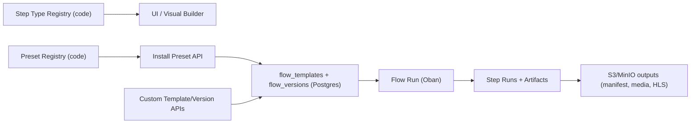

# Flow engine

The flow engine runs media processing as a versioned step graph (DAG) using Oban, with FFmpeg-heavy steps on FLAME workers.

## Concepts

- `step type` (registry): code-level capability, discoverable via `GET /v1/flow/step-types`.
- `preset` (registry): code-level starter flow definition, discoverable via `GET /v1/flow/presets`.
- `template` (DB): named flow (`publish_default`).
- `version` (DB): immutable template definition snapshot (DAG JSON + checksum).
- `run` (DB): one execution of a template/version.
- `step run` + `artifact`: per-step state and produced outputs (for example `manifest.json` in S3/MinIO).

## Installing presets

Presets are stored in code, but runs execute DB-backed template versions.

`POST /v1/flow/presets/:slug/install` is the bridge:

- creates or updates the `flow_template` row for that slug
- creates a new active `flow_version` only when the preset definition checksum changed
- returns existing active version when unchanged (idempotent install)
- returns `201 Created` when a new version is created, `200 OK` when unchanged

## Architecture


```mermaid
flowchart LR
  A["Step Type Registry (code)"] --> U["UI / Visual Builder"]
  B["Preset Registry (code)"] --> C["Install Preset API"]
  C --> D["flow_templates + flow_versions (Postgres)"]
  E["Custom Template/Version APIs"] --> D
  D --> F["Flow Run (Oban)"]
  F --> G["Step Runs + Artifacts"]
  G --> H["S3/MinIO outputs (manifest, media, HLS)"]
```

## API surface

- `GET /v1/flow/step-types`
- `GET /v1/flow/presets`
- `POST /v1/flow/presets/:slug/install`
- `POST /v1/flow/templates`
- `POST /v1/flow/templates/:template_id/versions`
- `POST /v1/flow/runs`
- `GET /v1/flow/runs/:id`

Current built-in preset:

- `publish_default`
- `publish_local` (lighter local-development preset without HEVC/AV1 variants)

Flow endpoints are admin-only. Requests are allowed only when the logged-in user
email matches `:mave_core, :flow_admin` `emails` or `email_domains`;
state-changing requests also need a valid CSRF token.
The examples below use the default local origin, `http://localhost:4000`.
Use your own space and embed identifiers in place of the example values.

## Quick start

1. Install the default preset into DB:

```bash
curl -X POST http://localhost:4000/v1/flow/presets/publish_default/install \
  -H "content-type: application/json" \
  -H "cookie: $MAVE_ADMIN_COOKIE" \
  -H "x-csrf-token: $MAVE_ADMIN_CSRF_TOKEN" \
  -d '{}'
```

2. Start a run (minimal input):

```bash
curl -X POST http://localhost:4000/v1/flow/runs \
  -H "content-type: application/json" \
  -H "cookie: $MAVE_ADMIN_COOKIE" \
  -H "x-csrf-token: $MAVE_ADMIN_CSRF_TOKEN" \
  -d '{
    "template_slug": "publish_default",
    "execution": "inline",
    "input": {
      "space_hash": "AAAAA",
      "embed_hash": "BBBBBBBBBB",
      "input_url": "https://example.com/video.mp4"
    }
  }'
```

3. Check run state:

```bash
curl "http://localhost:4000/v1/flow/runs/$MAVE_FLOW_RUN_ID" \
  -H "cookie: $MAVE_ADMIN_COOKIE"
```

## Execution modes

`POST /v1/flow/runs` supports:

- `execution: "inline"` (or `"sync"`): run inside request lifecycle, returns `200`.
- async/default (`execution` omitted): run scheduled on Oban, returns `202`.

Use inline for local debugging and deterministic smoke tests. Use async for production behavior.

`enqueue` is accepted (`true` by default), but most users should not set it manually.

## Audio player waveforms

The publishing presets include optional `media.generate_audio_peaks` work after
inspection and audio transcoding. It does not delay the playable manifest.
The output adds `waveform: {version: 1, duration, audio_track, peaks}` to the
manifest, with at most 512 amplitude peaks for the primary audio track. Silent
sources, unsupported durations and alternate tracks without matching peaks use
a normal audio-player timeline.

New runs select the current built-in preset version. Existing runs and pinned
custom versions do not gain steps automatically; reprocess with an updated flow
when peaks are needed for older media.

## Execution and recovery

By default:

- FLAME: heavyweight transfer/media steps (`asset.upload_original`, non-booster `media.transcode_*`, `media.extract_frame`, `media.generate_*`)
- Serverless booster: video/audio transcodes, frame extraction, and video/audio HLS packaging when the deployment enables it
- Inline: lightweight orchestration and HLS publication steps (`source.resolve`, `storage.ensure_space_bucket`, `media.package_hls_*`, `manifest.build`, `cdn.purge`, `event.notify_webhook`, etc.)

`GET /v1/flow/step-types` returns step metadata (`type`, `category`, `description`, `options`) so a visual builder can render clear, stable controls (for example step-level `strict`).

### Retry and orphan recovery

Flow step execution has a ledger-level retry budget independent of Oban's job
attempt counter. Queue admission snoozes may increase the Oban counter without
running a step, so `step_runs.attempt` and `execution_metadata.retry_policy`
are authoritative for actual execution.

By default, one automatic cycle permits at most three executions and one
orphan recovery. Exhausting either budget fails the step and lets the
coordinator fail or continue the run according to the step's required policy.
An explicit operator retry from `/flow/runs` starts a new automatic cycle while
preserving the lifetime step attempt count for diagnostics.

Recovery cancels the orphaned Oban job before scheduling its replacement.
Jobs belonging to terminal runs complete as cleanup and are not retried.
Recovering a failed run keeps succeeded steps and their artifacts intact. Any
parallel steps interrupted when the run became terminal are reset with a fresh
automatic retry budget, so completed renditions are not encoded again.

The run history separates open failures from resolved failures. A later
successful run for the same embed marks an earlier failed attempt as **Later
succeeded**. An operator can also close a failure as **Source unusable** from
its error details when the source is missing, empty or cannot be processed.
Both remain in **Resolved** and **All runs**, with their original execution
status, errors, timings and artifacts preserved. They are excluded from the
open **Failed** count. Retrying a closed run clears its closure and starts a
new retry cycle; another failure then needs attention again. Historical
performance statistics continue to count the actual execution failures.

### FFmpeg performance metadata

FFmpeg-backed media steps persist their final command performance summary in
`step_runs.execution_metadata.progress`. This includes video, audio, waveform,
frame, storyboard, segment, and HLS packaging work. The summary includes
realtime speed and FFmpeg wall time, plus encoded frames, average FPS, output
bytes, and dropped or duplicated frames when FFmpeg reports them. Audio and
single-frame commands normally do not report a meaningful FPS. `/flow/runs`
displays the available per-step values and aggregates completed realtime-speed
samples by hardware profile and workload.

Set `MAVE_HARDWARE_PROFILE` inside the worker runtime to a stable deployment
label such as `worker-standard`. The value should identify the instance class,
not an ephemeral pod or node. Deployment layers with multiple FLAME pools can
map pool-specific configuration to this generic worker variable.

### Optional encoding boosters

Deployments can send eligible encoding and packaging steps to an external CPU
or GPU booster. Oban still owns job state, retries, validation and publication;
the booster streams media directly to object storage. The app worker handles
progress and metadata rather than transferring rendition bytes.

Baseline playback renditions run before optional high-resolution and clip work.
Completed chunks are reusable across retries. Capacity-only deferrals do not
consume the execution retry budget. Queue and per-run limits bound background
work so it does not exhaust capacity needed by new uploads.

The completed upload is the canonical encoding source until the durable copy is
published. Core only marks playback ready after the corresponding player and
manifest writes succeed. Private playback and source protection still depend on
the configured storage adapter; see [private playback](private_playback.md).

Booster routing, credentials and fallbacks are deployment settings, not caller
input. Keep the CPU readiness probe disabled for scale-to-zero services that
use the encode request itself to trigger capacity. See the
[encoding booster guide](../deploy/encoding-booster/README.md) for setup, image
builds, environment variables and validation, and
[media security](media_security.md) for the parser boundary.

## Posters and thumbnails

Poster generation preserves the source aspect ratio within the output bounds.
Changing encoder defaults affects newly generated images; regenerate existing
images when they need the new settings.

## Subtitle language selection

An explicit `transcription_language` takes precedence, followed by the
transcription provider's language. Otherwise Core tries text-based detection,
then audio-track metadata, and finally `und` (unknown). It does not assume
English. Detection uses `MISTRAL_API_KEY`; applications can supply a
`:language_detection_provider` implementing `detect/1` or configure
`:language_detection_model`. See
[`LanguageDetector`](../lib/mave_core/transcription/language_detector.ex) for the interface.

## Debugging

For deterministic local tests, provide `source_body` with
`source_content_type`, `media_probe`, or `transcription_text` /
`transcription_vtt` / `transcription_segments` as appropriate.

Media step `*_mode` inputs select `auto`, `ffmpeg` or `copy`. Step-level
`params.strict` makes errors fail the run; the corresponding run-input
`*_strict` override takes precedence. These overrides are for debugging and
custom flows. Discover current step options through `/v1/flow/step-types` and
[`StepRegistry`](../lib/mave_core/flow/step_registry.ex), rather than relying on
a separate copy of every step's parameters.

`flow_step_executor: "inline"` or `flow_disable_flame_steps: true` forces local
execution for a diagnostic run. Avoid doing this on request-serving nodes for
heavy media work. Keep endpoint, credential and storage policy configuration
at deployment level.

## Manifest parity check

```bash
mix flow.manifest.parity /tmp/mave-manifest.json /tmp/core-manifest.json
```

Or compare against S3/MinIO directly:

```bash
mix flow.manifest.parity \
  /tmp/mave-manifest.json \
  s3://space-AAAAA/BBBBBBBBBB/manifest.json
```

## Background execution

Async flows require Oban queues to be running. The standalone application and
self-hosted bundle configure them already. If you customize runtime roles,
ensure at least one worker executes the queues required by your selected flow;
an HTTP endpoint that accepts a run is not proof that a worker is consuming it.

Release nodes refuse to start without `RELEASE_COOKIE` (at least 32 characters).
Give every node of one deployment the same secret value from your secret store.
The Kubernetes FLAME backend passes the parent's cookie to runner pods. Anyone
who can reach a node's distribution ports with that cookie can run code on it,
so restrict those ports to the deployment's own nodes as well.
